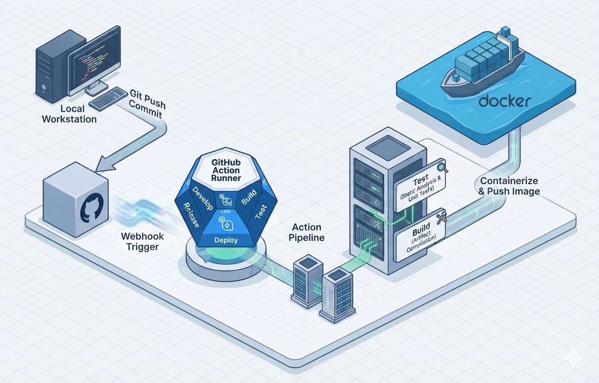
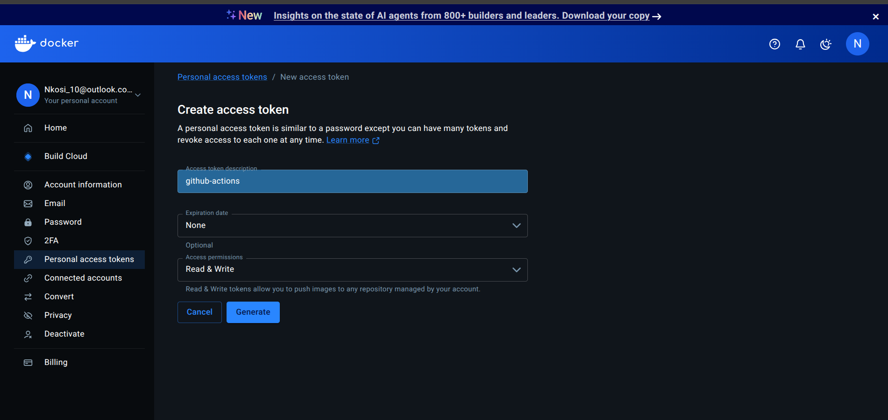
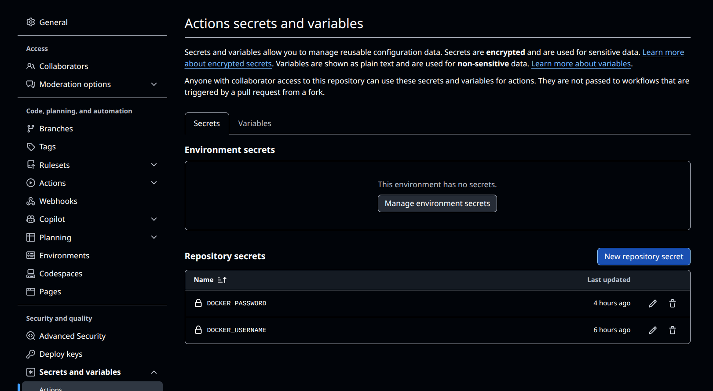
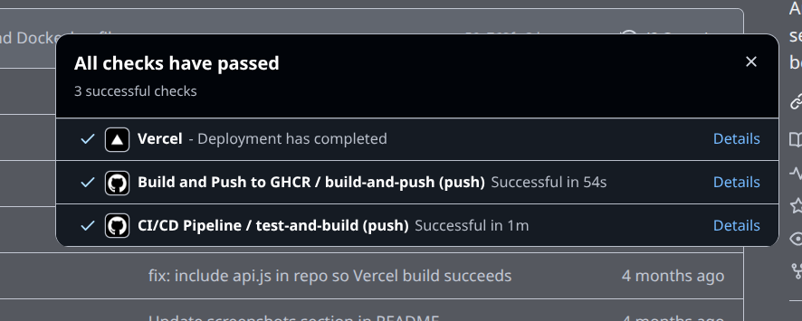
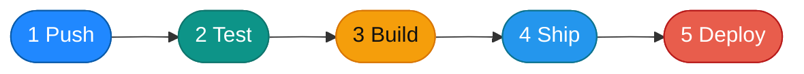
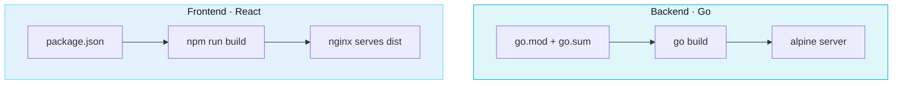

<div align="center">

<h1 style="font-size:2.4rem; font-weight:800; letter-spacing:-0.5px; border-bottom: 3px solid #2496ED; padding-bottom: 12px; display:inline-block;">CI/CD + Docker with GitHub Actions</h1>

<p><strong>FoxVue first-timer guide</strong> — Go backend · React frontend · Docker · GitHub Actions</p>

[](https://docs.github.com/en/actions)
[](https://docs.docker.com/)
[](https://hub.docker.com)
[](https://go.dev)
[](https://react.dev)
[](#step-6--push-and-confirm-success)



</div>

---

<h2 style="font-size:1.5rem; font-weight:700; color:#2496ED; border-left:4px solid #2496ED; padding-left:12px; margin-top:2rem;">Pictures first — what success looks like</h2>

Open this file in **Markdown Preview** (`Ctrl+Shift+V`) to see these images.

### 1) Docker Hub — create your token



### 2) GitHub — save secrets



### 3) GitHub — all checks passed



---

<h2 style="font-size:1.5rem; font-weight:700; color:#2496ED; border-left:4px solid #2496ED; padding-left:12px; margin-top:2rem;">What you will learn</h2>

| You learn | Why it matters |
|---|---|
| Create a Docker Hub token | So GitHub can push images for you |
| Save secrets in GitHub | So passwords never live in your code |
| Write Dockerfiles for Go + React | So each app packs correctly |
| Wire GitHub Actions | So merges to `main` ship for you |
| Avoid our real failures | So you skip days of red runs |

---

<h2 style="font-size:1.5rem; font-weight:700; color:#2496ED; border-left:4px solid #2496ED; padding-left:12px; margin-top:2rem;">The big picture</h2>

You push code → GitHub Actions tests it → Docker builds images → images land on Docker Hub → you can deploy them.



| Term | Meaning | FoxVue |
|---|---|---|
| **CI** | Prove the code still works | Go tests + React build |
| **CD** | Package and publish automatically | Push images on `main` |
| **Docker image** | Portable copy of the app | `backend-app` / `frontend-app` |
| **Registry** | Online shelf for images | Docker Hub |
| **Workflow** | YAML recipe | `.github/workflows/ci-cd.yml` |

> [!IMPORTANT]
> Get `docker build` working on your laptop first. If it fails locally, CI will fail too.

---

<h2 style="font-size:1.5rem; font-weight:700; color:#2496ED; border-left:4px solid #2496ED; padding-left:12px; margin-top:2rem;">Step 1 — Create your Docker Hub account (~2 minutes)</h2>

[](#step-1--create-your-docker-hub-account-2-minutes)

You need an online shelf for your Docker images.

1. Go to [hub.docker.com](https://hub.docker.com) and sign up.
2. Profile icon → **Account Settings** → **Security**.
3. **Personal access tokens** → **Generate new token**.
4. Name it `github-actions`.
5. Permissions: **Read & Write**.
6. Click **Generate** and copy the token now — you will not see it again.

> [!WARNING]
> Keep that token ready for Step 2. Lost it? Revoke and make a new one.


---

<h2 style="font-size:1.5rem; font-weight:700; color:#2496ED; border-left:4px solid #2496ED; padding-left:12px; margin-top:2rem;">Step 2 — Save secrets in GitHub</h2>

[](#step-2--save-secrets-in-github)

Never put passwords in code. Put them in GitHub Secrets.

1. Open your repo on GitHub → **Settings**.
2. **Secrets and variables** → **Actions**.
3. **New repository secret**
   - Name: `DOCKER_USERNAME`
   - Secret: your Docker Hub username
4. **New repository secret** again
   - Name: `DOCKER_PASSWORD`
   - Secret: the access token from Step 1


> [!TIP]
> Workflow uses `${{ secrets.DOCKER_USERNAME }}` and `${{ secrets.DOCKER_PASSWORD }}`. GitHub fills them in at runtime.

---

<h2 style="font-size:1.5rem; font-weight:700; color:#2496ED; border-left:4px solid #2496ED; padding-left:12px; margin-top:2rem;">Step 3 — One Dockerfile per app</h2>

[](#step-3--one-dockerfile-per-app)

FoxVue has two apps → two recipes. Do not mix them.



| | Backend | Frontend |
|---|---|---|
| Language | Go | React |
| Folder | `backend/` | `frontend/` |
| Copies | `go.mod` + `go.sum` | `package.json` + lockfile |
| Build | `go build` | React build → static files |
| Runs as | Go server | nginx |

**Backend** — `backend/Dockerfile`

```dockerfile
FROM golang:1.25-alpine AS builder
WORKDIR /app
COPY go.mod go.sum ./
RUN go mod download
COPY . .
RUN CGO_ENABLED=0 GOOS=linux go build -o server .

FROM alpine:latest
WORKDIR /root/
COPY --from=builder /app/server .
EXPOSE 8080
CMD ["./server"]
```

**Frontend** — `frontend/Dockerfile`

```dockerfile
FROM node:20-alpine AS builder
WORKDIR /app
COPY package*.json ./
RUN npm ci
COPY . .
RUN npm run build

FROM nginx:alpine
COPY --from=builder /app/dist /usr/share/nginx/html
EXPOSE 80
CMD ["nginx", "-g", "daemon off;"]
```

> [!CAUTION]
> Do not paste a Go Dockerfile into `frontend/`. That is how we got `go.sum: not found`.

Test locally first:

```bash
docker build -f frontend/Dockerfile frontend
docker build -f backend/Dockerfile backend
```

---

<h2 style="font-size:1.5rem; font-weight:700; color:#2496ED; border-left:4px solid #2496ED; padding-left:12px; margin-top:2rem;">Step 4 — Create the workflow folder</h2>

[](#step-4--create-the-workflow-folder)

```bash
mkdir -p .github/workflows
```

GitHub only runs files in `.github/workflows/*.yml`.

---

<h2 style="font-size:1.5rem; font-weight:700; color:#2496ED; border-left:4px solid #2496ED; padding-left:12px; margin-top:2rem;">Step 5 — Write the pipeline</h2>

[](#step-5--write-the-pipeline-ci-then-cd)

Create this file: `.github/workflows/ci-cd.yml`

The pipeline does two things in order:

**Part 1 — CI (runs on every push and pull request)**
- Checks out your code
- Runs Go tests on the backend
- Builds the React frontend to catch any errors

**Part 2 — CD (only runs when you push to `main`)**
- Logs into Docker Hub using your saved secrets
- Builds and pushes the backend image
- Builds and pushes the frontend image

Here is the full file to copy in:

```yaml
name: CI/CD Pipeline

on:
  push:
    branches: [ "main" ]
  pull_request:
    branches: [ "main" ]

jobs:
  test-and-build:
    runs-on: ubuntu-latest
    steps:

      # --- Get the code ---
      - uses: actions/checkout@v4

      # --- Test the backend ---
      - uses: actions/setup-go@v5
        with:
          go-version: '1.25'

      - name: Run Go Tests
        run: |
          cd backend
          go test ./...

      # --- Build the frontend ---
      - uses: actions/setup-node@v4
        with:
          node-version: 20

      - name: Build Frontend
        run: |
          cd frontend
          npm ci
          npm run build

      # --- Push images to Docker Hub (main branch only) ---
      - name: Log in to Docker Hub
        if: github.ref == 'refs/heads/main' && github.event_name == 'push'
        uses: docker/login-action@v3
        with:
          username: ${{ secrets.DOCKER_USERNAME }}
          password: ${{ secrets.DOCKER_PASSWORD }}

      - name: Build and Push Backend
        if: github.ref == 'refs/heads/main' && github.event_name == 'push'
        uses: docker/build-push-action@v5
        with:
          context: ./backend
          file: ./backend/Dockerfile
          push: true
          tags: ${{ secrets.DOCKER_USERNAME }}/backend-app:latest

      - name: Build and Push Frontend
        if: github.ref == 'refs/heads/main' && github.event_name == 'push'
        uses: docker/build-push-action@v5
        with:
          context: ./frontend
          file: ./frontend/Dockerfile
          push: true
          tags: ${{ secrets.DOCKER_USERNAME }}/frontend-app:latest
```

> [!TIP]
> The `if:` condition on the last three steps is important — it means Docker images only get published when you push to `main`, not on every pull request.

---

<h2 style="font-size:1.5rem; font-weight:700; color:#2496ED; border-left:4px solid #2496ED; padding-left:12px; margin-top:2rem;">Step 6 — Push and confirm success</h2>

[](#step-6--push-and-confirm-success)

```bash
git add .github/workflows backend/Dockerfile frontend/Dockerfile
git commit -m "Add CI/CD pipeline for Docker images"
git push origin main
```

When it works, GitHub looks like this:


Then check Docker Hub for your new image tags.

---

<h2 style="font-size:1.5rem; font-weight:700; color:#2496ED; border-left:4px solid #2496ED; padding-left:12px; margin-top:2rem;">Things we broke — so you don’t</h2>

[](#things-we-broke--so-you-dont)

### 1. Frontend Dockerfile was secretly a Go Dockerfile

CI used `context: ./frontend`, but the frontend Dockerfile still had:

```dockerfile
COPY go.mod go.sum ./
```

Docker looked for `frontend/go.sum` → crash:

```text
ERROR: failed to calculate checksum ... "/go.sum": not found
```

**Avoid:** reusing the backend Dockerfile for React. Keep Go in `backend/`, React in `frontend/`.

**Prevent:**

```bash
docker build -f frontend/Dockerfile frontend
docker build -f backend/Dockerfile backend
```

### 2. Missing `go.sum` on the backend

```bash
cd backend && go mod tidy && git add go.sum
```

### 3. Secrets typed into YAML

Use `${{ secrets.DOCKER_PASSWORD }}` only. If a token hits git, revoke it.

### 4. Publishing on every PR

```yaml
if: github.ref == 'refs/heads/main' && github.event_name == 'push'
```

### 5. Wrong context path

`COPY` only sees files inside `context:` — not the whole repo.

---

<h2 style="font-size:1.5rem; font-weight:700; color:#2496ED; border-left:4px solid #2496ED; padding-left:12px; margin-top:2rem;">Quick debug table</h2>

| Symptom | Likely cause | Fix |
|---|---|---|
| `go.sum` missing on **frontend** | Frontend Dockerfile still has Go lines | Use React + nginx Dockerfile |
| `go.sum` missing on **backend** | File not committed / bad context | `go mod tidy` + commit |
| Docker Hub login fails | Bad/expired token | New token → update secret |
| PR publishes images | No `if:` guard | Push only on `main` |
| Local OK, CI fails | Different build path | Match CI `docker build -f` |

---

<h2 style="font-size:1.5rem; font-weight:700; color:#2496ED; border-left:4px solid #2496ED; padding-left:12px; margin-top:2rem;">Day-one checklist</h2>

- [ ] Docker Hub token created  
- [ ] `DOCKER_USERNAME` + `DOCKER_PASSWORD` saved in GitHub  
- [ ] Separate Go + React Dockerfiles  
- [ ] Local `docker build` works for both  
- [ ] Workflow added  
- [ ] Green checks like the success screenshot  

---

<h2 style="font-size:1.5rem; font-weight:700; color:#2496ED; border-left:4px solid #2496ED; padding-left:12px; margin-top:2rem;">Official links</h2>

- [GitHub Actions quickstart](https://docs.github.com/en/actions/get-started/quickstart)
- [Docker Hub access tokens](https://docs.docker.com/security/for-developers/access-tokens/)
- [Secrets in Actions](https://docs.github.com/en/actions/security-guides/using-secrets-in-github-actions)
- [Publish Docker images](https://docs.github.com/en/actions/use-cases-and-examples/publishing-packages/publishing-docker-images)

---

**FoxVue · Interview-Dojo · Nkosimphile Khumalo**
